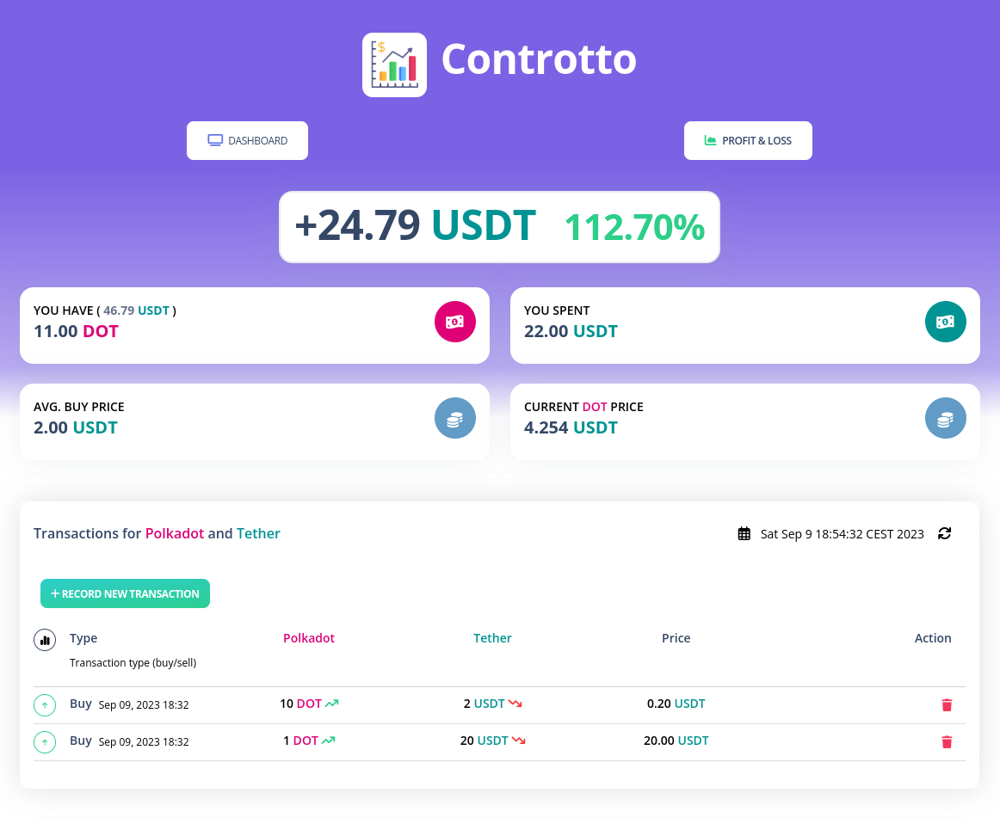
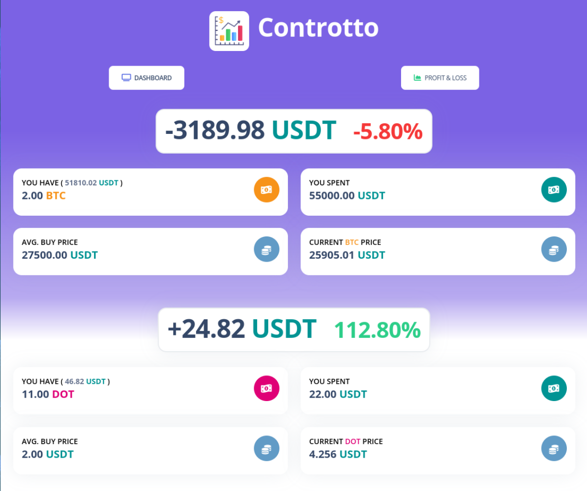

# 📊 Controtto

A self-hosted, P&L tracker made with Go, HTMX and *no JavaScript*. Controtto, keeps track of your transaction saving it in a sqlite file, and returns all sorts of calculations including:
* Avg. Buy price
* Current asset value
* Transaction history
* Profit & Loss 

In order to fetch the price of an asset, Controtto relies on mainly 3 API ([see code](https://github.com/contre95/controtto/tree/main/src/gateways/markets)). 
* [Binance](https://api.binance.com/api/v3/ticker/price) - Public API, no token needed.
* [BingX](https://open-api.bingx.com/openApi/swap/v2/quote/price) - Public API, no token needed.
* [Alpha Vantage](https://www.alphavantage.co/) - Mainly for stocks, free but short rate limit. ([get](https://www.alphavantage.co/support/#api-key) an token and set `CONTROTTO_AVANTAGE_TOKEN`) 

## Screenshots
See some illustrative screenshorts.

Trading pair | Dashboard
:-------------------------:|:-------------------------:
 | 

## Configurations

All configurations are set in the `.env` file and passed as environment variables. Variables `CONTROTTO_PORT` and `CONTROTTO_DB_PATH` are available.
```sh
# Install the dependencies
go mod tidy
# Set the .env
mv .env.example .env
# Source the env variables
. <(cat .env | grep -v -e '^$' | grep -v "#" | awk '{print "export " $1}')
```

## Build and Run 
```sh
go run ./cmd/main.go # go build ./cmd/main.go to just build it
```

## Development env
```sh
go install github.com/cosmtrek/air@latest # Download air
air -c air.toml
```
and access [localhost:3000](http://localhost:3000)

## Run with Podman
If you want to Docker, simply replace `podman` with `docker`.

```sh
mkdir data
podman container run --rm -p 8000:8000 -v $(pwd)/data:/data contre95/controtto
```

## Run tests
```sh
go test -cover ./...
#   Expected result
#   ?       controtto/cmd   [no test files]
#   ?       controtto/src/app/managing      [no test files]
#   ?       controtto/src/domain/pnl        [no test files]
#   ?       controtto/src/gateways/markets  [no test files]
#   ?       controtto/src/gateways/sqlite   [no test files]
#   ?       controtto/src/presenters        [no test files]
#   ok      controtto/src/app/querying      0.003s  coverage: 40.7% of statements
```
### TODO
* More tests
* Wrappers for logging and metrics would be nice as well.
* Remove all the CSS and use custom `style.css` + Tailwind CDN.
